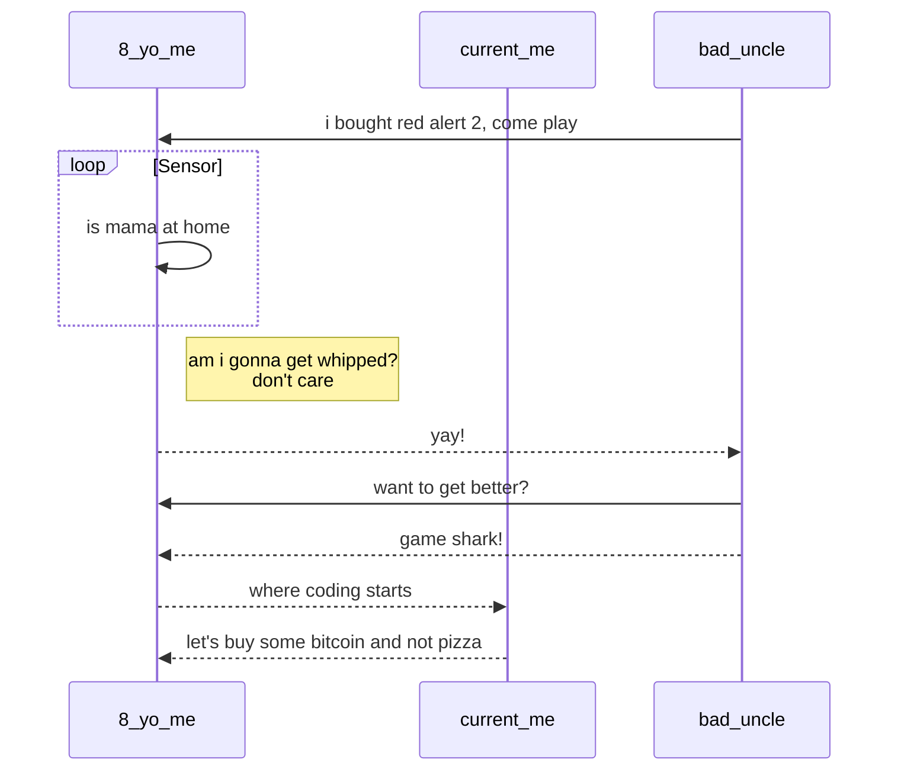

## 你好 Hi 😋

I am a small potato level data engineer who is enthusiastic on burning\
down warehouses and infrastructure. My number one goal is to trigger your pagerduty\
while making sure mine doesn't, such a lovely mate, am I.

## Projects/Explorations
### In-Progress Mode
1. [fuse-mart](https://github.com/davionchai/fuse-mart) - Fully abstracted Batch/Streaming platform
1. [de-tools](https://github.com/davionchai/de-tools) - Pipeline level explorations

### Maintenance Mode
1. [snowflake-was](https://github.com/davionchai/snowflake-was) - Auto scaling snowflake warehouses

## My Code Journey:

